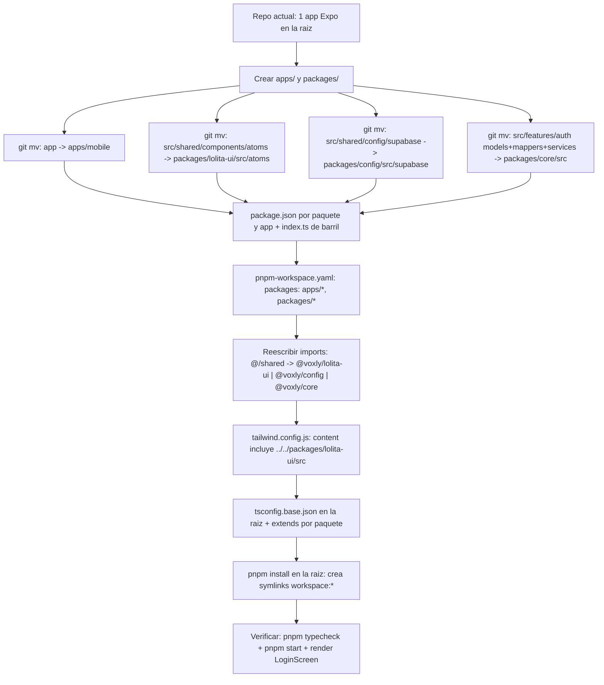
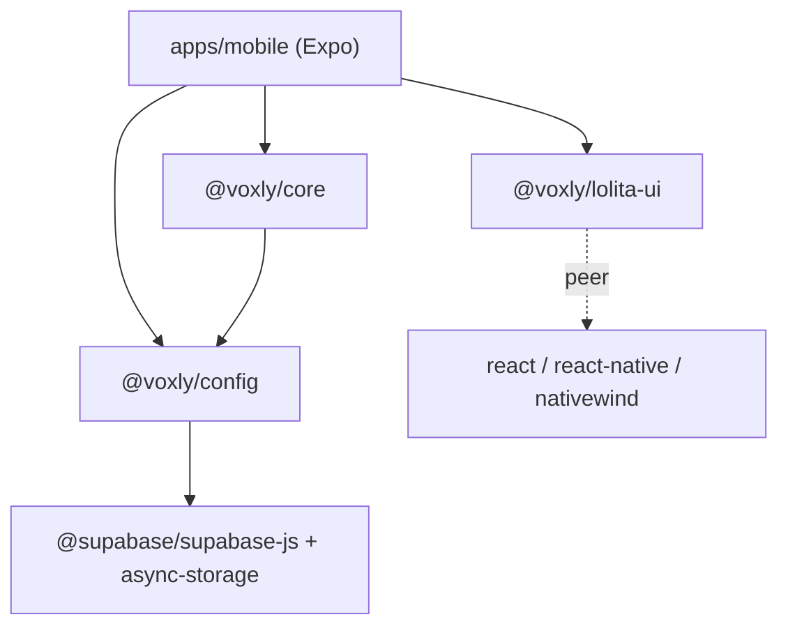

# Migración a monorepo (pnpm workspaces)

Cómo `voxly-ai` pasó de **una app Expo en la raíz** a un **monorepo pnpm** con la
app en `apps/mobile/` y el código reutilizable en `packages/*`.

## Estructura

```
voxly-ai/
├── apps/
│   └── mobile/            # la app Expo (todo lo específico de app)
│       ├── App.tsx  index.ts  app.json
│       ├── babel.config.js  metro.config.js  tailwind.config.js  global.css
│       ├── package.json  tsconfig.json  assets/
│       └── src/features/auth/screens/Login.screen.tsx
├── packages/
│   ├── lolita-ui/                # @voxly/lolita-ui   — componentes atoms (Button, Chip, IconButton)
│   ├── config/            # @voxly/config — cliente Supabase
│   └── core/              # @voxly/core  — models, mappers, services de dominio
├── package.json           # raíz: private, scripts que delegan, devDeps compartidas
├── pnpm-workspace.yaml     # packages: apps/*, packages/*  +  nodeLinker: hoisted
├── tsconfig.base.json      # compilerOptions comunes para los paquetes
└── docs/monorepo-migration.md
```

Los paquetes **no tienen paso de build**: `main`/`types` apuntan a `src/index.ts`
y Metro/Babel transpilan el TS directamente. Para publicarlos a npm en el futuro
habría que añadir build + `exports`.

## Proceso de migración



> **Metro:** Expo SDK 52+ autoconfigura Metro para monorepos, así que
> `metro.config.js` no cambia. Si aparece *Unable to resolve @voxly/...*, añadir
> `config.watchFolders = [workspaceRoot]` y `config.resolver.nodeModulesPaths`.

## Grafo de dependencias



## Comandos

| Acción | Comando |
|---|---|
| Instalar todo | `pnpm install` (en la raíz) |
| Arrancar la app | `pnpm start` (delega en `pnpm --filter mobile start`) |
| Typecheck de todo | `pnpm typecheck` (`pnpm -r exec tsc --noEmit`) |
| Añadir dep a la app | `pnpm --filter mobile add <pkg>` |
| Añadir dep a un paquete | `pnpm --filter @voxly/lolita-ui add <pkg>` |

## Notas / gotchas

1. **NativeWind**: `content` en `apps/mobile/tailwind.config.js` debe incluir
   `../../packages/lolita-ui/src/**` o los `className` de los componentes se purgan y
   salen sin estilo.
2. `@voxly/lolita-ui` usa clases de fuente (`font-jakarta-*`) definidas en el `theme` de
   tailwind de la app → el paquete no es visualmente autónomo. Si se publica,
   mover el `theme` a un preset compartido.
3. `pnpm` necesita `nodeLinker: hoisted` (ya en `pnpm-workspace.yaml` y `.npmrc`)
   para que Metro resuelva las dependencias nativas.
4. Variables de entorno de Supabase van en `apps/mobile/.env`
   (`EXPO_PUBLIC_SUPABASE_URL`, `EXPO_PUBLIC_SUPABASE_KEY`).
